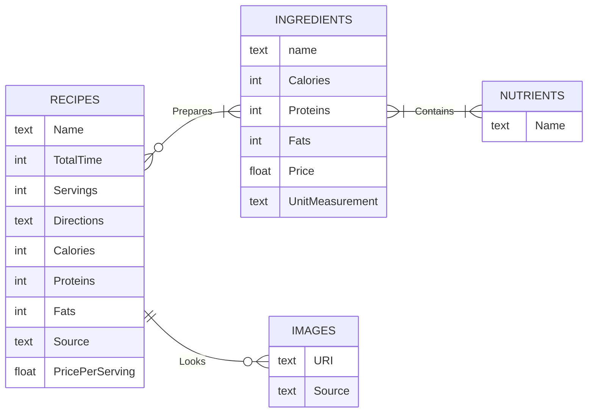

# ETL Pipelines <!-- omit in toc -->

## Table of Contents <!-- omit in toc -->
- [Data Sources](#data-sources)
  - [Datos para SQL Database e Image Storage](#datos-para-sql-database-e-image-storage)
  - [Documentos para (Graph)RAG y Vectorial Database](#documentos-para-graphrag-y-vectorial-database)
- [Metadatos y Esquemas](#metadatos-y-esquemas)
  - [Recetas](#recetas)
  - [Ingrediente](#ingrediente)
  - [Imágenes](#imágenes)
  - [Textos Médicos y Nutricionales](#textos-médicos-y-nutricionales)
- [Almacenamiento y Organización de los Datos](#almacenamiento-y-organización-de-los-datos)
  - [Almacenamiento](#almacenamiento)
  - [Organización](#organización)
- [Pipelines](#pipelines)
  - [Pipeline para allrecipes](#pipeline-para-allrecipes)

## Data Sources
Fuentes de datos para cada tipo de base de datos que se van a poblar a lo largo del proyecto. Se tiene contemplado lo siguiente:
* Una base de datos SQL para almacenar las diferentes recetas y sus datos relacionados (instrucciones, ingredientes, valores nutricionales, precio) con el fin de que sea consultada por medio de la IA usando MCP y para desplegar las recetas en un buscador. Por los objetivos adicionales del proyecto, es necesario consolidar entidades al momento de relacionar los ingredientes de las recetas con sus valores nutricionales.
* Un almacenamiento basado en objetos para preservar las imágenes ilustrativas de las recetas extraídas.
* Una base de datos vectorial para almacenar los documentos de las recetas con el fin de que el modelo de IA pueda entender y comprender qué recetas son más convenientes recomendar para crear el menú semanal

### Datos para SQL Database e Image Storage
De las siguientes fuentes se van a extraer: Datos estadísticos (valores nutricionales, precios), Textos (instrucciones de preparación, ingredientes), Imágenes (cómo se ven las recetas)
* [Allrecipes: Mexican Cuisine](https://www.allrecipes.com/recipes/728/world-cuisine/latin-american/mexican/)
    - Recetas con inspiración y "toques" mexicanos
    - Extraer todos las recetas y su información relevante de ingredientes, instrucciones, tiempo de preparación y sus aportes nutricionales
* [Kiwilimon: Recetas](https://www.kiwilimon.com/recetas)
    - Recetas tradicionales y de inspiración regionales
    - Extraer recetas de ciertas categorías y su información relevante de ingredientes, instrucciones y tiempo de preparación
    - No cuentan con aportes nutricionales, por lo que es necesario generar sus aportes nutricionales
* [EatRight: Recipes](https://www.eatright.org/recipes)
    - Recetas internacionales con orientación nutricional y realizadas por expertos
    - Extraer todas las recetas y su información relevantes de ingredientes, para hacerlas y sus aportes nutricionales
* [Base de Datos BEDCA](https://www.bedca.net/bdpub/index.php)
    - Base de datos con la composición y aportes nutricionales (nutrientes, calorías) de algunos alimentos e ingredientes
    - Extraer todos los ingredientes junto con sus aportes nutricionales relevantes
* [INSP: Base de Alimentos de México](https://insp.mx/informacion-relevante/bam-bienvenida)
    - Base de datos con la composición y aportes nutricionales de algunos alimentos e ingredientes comunes de la cocina mexicana
    - Procesar y limpiar las entradas de los alimentos e ingredientes
* [PROFECO: Quién es Quién en los Precios](https://qqp.profeco.gob.mx/)
    - Repositorio de precios de productos e ingredientes ofertados en supermercados
    - Extraer el precio de los ingredientes de interés
* [Sistema Nacional de Información e Integración de Mercados (SNIIM)](https://www.economia-sniim.gob.mx/)
    - Repositorio de precios de productos e ingredientes ofertados en mercados y centrales de abastos
    - Extraer el precio de ingredientes frescos de interés

### Documentos para (Graph)RAG y Vectorial Database
De las siguientes fuentes se van a extraer: Textos y Documentos (relacionados sobre salud, nutrición, dietas y wellness)
* [WHO Fact Sheet](https://www.who.int/news-room/fact-sheets)
    - Extraer textos relevantes sobre alimentación, dietas, salud alimentaria y manejo de alimentos
    * [Healthy diet](https://www.who.int/news-room/fact-sheets/detail/healthy-diet)
    * [Food safety](https://www.who.int/news-room/fact-sheets/detail/food-safety)
    * [Malnutrition](https://www.who.int/news-room/fact-sheets/detail/malnutrition)
    * [Obesity and overweight](https://www.who.int/news-room/fact-sheets/detail/obesity-and-overweight)
* [INSP (Instituto Nacional de Salud Pública, México)](https://insp.mx/) y Gobierno de México:
    - Extraer texto de las guías de alimentación para la población mexicana
    * [Guías Alimentarias y de Actividad Física](https://www.insp.mx/images/stories/2015/Noticias/Nutricion_y_Salud/Docs/151118_guias_alimentarias.pdf)
    * [Guías Alimentarias Saludables y Sostenibles para la Población Mexicana](https://www.gob.mx/cms/uploads/attachment/file/1029510/Guias_Alimentarias_Mexico_2025.pdf)
* [EatRight: Health](https://www.eatright.org/health)
    - Extraer textos relacionados al cuidado personal (wellness) y sobre nutrición en las condiciones de salud
* [Larousse Cocina: Técnicas](https://laroussecocina.mx/tecnicas/)
    - Extraer información sobre algunas técnicas y formas de preparación
* [SEP](https://www.gob.mx/sep):
    - Extraer textos relevantes sobre cómo es la alimentación ideal en las escuelas
    * [Recomendaciones para una Alimentación Saludable](https://educacionbasica.sep.gob.mx/multimedia/RSC/BASICA/Documento/201611/201611-3-RSC-l100yBJI2X-alimentacion_saludable.pdf)
    * [Servicio de Alimentación: Guía 2025](https://laescuelaesnuestra.sep.gob.mx/storage/recursos/material_consulta/GUIAS_2025/qPdyVcOLpc-20250127_GUIA_ALIMENTACION_V8.pdf)

## Metadatos y Esquemas
Para cada objeto abstracto/relevante para las bases de datos, se definen sus esquemas de metadatos:

### Recetas
* Formato de Archivo:
    - `.sql` (Debido a que estos valores están en una base de datos SQL)
* Atributos:
    - Nombre de la Receta
      - *String*
      - Nombre completo o referente a la receta
    - Tiempo Total de Preparación
      - Valores enteros positivos 
      - Tiempo en minutos requerido para elaborar el platillo, este tiempo incluye los tiempos como de cocción o de horneado
    - Porciones
      - Valores enteros positivos
      - Número de porciones o raciones por preparación
    - Ingredientes
      - Lista de ingredientes
      - Nombre
        - *String* 
        - Nombre del ingrediente necesario para preparar la receta
      - Cantidad
        - Número flotante
        - Cantidad del ingrediente para preparar la receta
      - Unidades de Medida
        - *String*
        - Unidad para medir la cantidad de un ingrediente
    - Instrucciones
      - Lista de *strings*
      - Pasos detallados para elaborar la receta 
    - Calorías Totales
      - Número flotante
      - El total de aporte energético de una porción de la receta 
    - Nutrientes
      - Lista de los aportes nutricionales
      - Nombre
        - *String*
        - Nombre representativo del nutriente presente en una receta
      - Cantidad
        - Número flotante
        - Cantidad del nutrientes presente en la receta
    - Precio por Porción
      - Valores flotantes positivos
      - Precio (costo) estimado de cada porción
    - Origen
      - *String*
      - Fuente URL de la que proviene la receta
    - Imágenes Ilustrativas
      - Lista de *String*
      - Referencias URI a la ubicaciones en la Image DB de las imágenes de cómo se ve la receta servida o terminada de preparar
* Fecha de Extracción:
    - Fecha en la que se recuperó la receta
* Versión:
    - Número/representación de la versión en la DB

### Ingrediente
* Formato de Archivo:
    - `.sql` (Debido a que estos valores están en una base de datos SQL)
* Atributos:
    - Nombre del Ingrediente:
      - *String*
      - Nombre completo de un ingrediente
    - Calorías
      - Número flotante
      - Aporte energético en 100gr del ingrediente
    - Nutrientes
      - Nombre de Nutrientes
        - Lista de *String*
        - Nombre representativo de los macronutrientes y micronutrientes presentes en el ingrediente
      - Cantidad de Nutrientes
        - Lista de números flotantes
        - Cantidad de cada uno de los nutrientes presentes en 100gr del ingrediente
    - Precio
      - Valores flotantes positivos
      - Precio (costo) de adquirir cierta medida del ingrediente
    - Unidad de Medición
      - *String*
      - Unidad usada para determinar el precio
* Fecha de Extracción:
    - Fecha en la que se recuperó la receta
* Versión:
    - Número/representación de la versión en la DB

### Imágenes
* Formato de Imagen:
    - Formato `.jpg`
* Atributos:
    - Identificador de Receta
      - *String*
      - ID de la receta en la SQL DB que se ilustra en la imagen
    - Contenido
      - Mapa de bits (colores)
      - Representación de la imagen en sí como bits
    - Origen
      - *String*
      - Fuente URL de la que proviene la imagen
* Número de Imágenes:
    - Número de imágenes en la DB
* Fecha de Extracción:
    - Fecha en la que se descargó la imagen
* Versión:
    - Número/representación de la versión em la DB

### Textos Médicos y Nutricionales
* Formato de Archivo:
    - `embeddings` (vector de texto embebido, debido a que estos documentos están en una base de datos vectorial)
* Atributos:
    - Titulo del Texto
      - *String*
      - Título, nombre o siglas que representan el documento o texto
    - Contenido
      - *String*
      - Contenido en texto plano (`.txt` o `.pdf`) o estructurado (`.md`) sobre la información del documento o texto
      - Este atributo solo está presente durante la Extracción, luego se va a embeber en un vector para el RAG
    - Fecha de Publicación
      - *Datetime*
      - Fecha en formato *YYYY/MM/DD* en la que se publicó el texto
    - Origen
      - *String*
      - Fuente URL de la que proviene el texto
    - Autor/Origen/Institución Emisora:
      - Ente encargo de la publicación o emisión del documento en internet
* Fecha de Extracción:
    - Fecha en la que se obtuvo el documento
* Versión:
    - Número/representación de la versión en la DB

## Almacenamiento y Organización de los Datos
De los objetos relevantes, cada uno pertenece a un tipo de database diferente, esto debido a la naturaleza de cómo se tienen que almacenar para mejorar su disposición para el sistema de IA y, por lo tanto, al usuario final (los comités en cada escuela). Una parte de los datos extraídos no son visibles para el usuario (documentos, ciertas recetas) pero que sí lo son para la IA al momento de consultar y generar sugerencias de los menús a la escuelas. En cambio, la mayor parte de las recetas serán visibles por el usuario al momento que empiece a explorar las posibilidades de preparaciones.

### Almacenamiento
Los datos que son extraídos y transformados serán almacenados en tres tipos de bases de datos:
* SQL DB en Postgres para almacenar los datos de las recetas (ingredientes, aportes nutricionales, referencias URI a sus imágenes). Tanto en development y production se emplea la ejecución local (en el host) de PostgresSQL

* Almacenamiento basado en Objetos (Object-based Storage) para almacenar las imágenes de las recetas. En development se emplea el almacenamiento local y en production S3 de AWS
* Vector DB para almacenar los embeddings de los documentos y textos extraídos. Tanto en development y production se emplea la ejecución local  (en el host) de Qdrant (se considera usar S3 de AWS para almacenar los embeddings en production)

### Organización
Para la interfaz del usuario se planea hacer dos paneles, uno con el pueda chatear con la IA para la planificación de sus recetas y otro para visualizar las posibles preparaciones con las que cuenta el sistema, y que estos paneles se encuentren en tabs en un menú lateral ocultable.

## Pipelines
Para la creación de las diferentes pipelines y process dentro del ETL se usó principalmente Python junto con [Crawl4ai](https://crawl4ai.com/), lo cual permitió que la tarea de extracción fuera simple de realizar y sin complicaciones.

### Pipeline para allrecipes
* [*E*] De la página [allrecipes](https://www.allrecipes.com), se extrajeron las recetas de la cocina mexicana únicamente. De los datos presentes en la página, no se pudieron recopilar los referentes a precio por porción
* [*T*] De cada receta, solo se formatearon los valores y atributos de interés para el proyecto para adecuarse al esquema de metadatos, además se añadieron aquellos valores faltantes en base a los demás datos extraídos
* [*L*] De los atributos extraídos, transformados y añadidos de cada receta, son cargados hacia la base de datos SQL usando las adecuadas inserciones