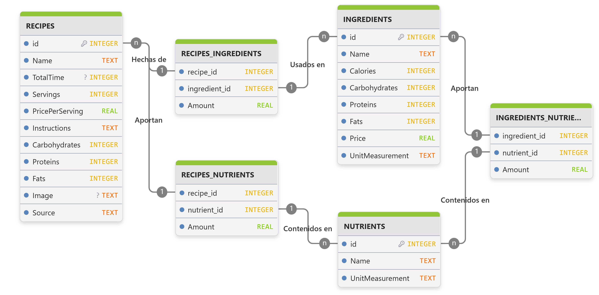

# ETL Pipelines <!-- omit in toc -->

## Table of Contents <!-- omit in toc -->
- [Data Architecture](#data-architecture)
- [Recipes and Ingredients Database](#recipes-and-ingredients-database)
  - [Data Sources and Acquisition](#data-sources-and-acquisition)
  - [Nutritional and Cost Imputation](#nutritional-and-cost-imputation)
  - [Entity Resolution](#entity-resolution)
  - [Persistence and Storage](#persistence-and-storage)
- [\[Proposal Not Fully Implemented\] Documents Database](#proposal-not-fully-implemented-documents-database)
  - [Data Acquisition](#data-acquisition)
  - [Embedding Representation](#embedding-representation)
  - [Persistence and Vector Storage](#persistence-and-vector-storage)
- [Database Challenges and Known Limitations](#database-challenges-and-known-limitations)
- [References](#references)

## Data Architecture
The system's core relies on the **ingestion and processing of three primary data streams**: culinary **preparations**, **ingredient** metadata, and specialized **nutritional literature**. Our ETL pipelines handle the transition from raw sources to **production-ready data**:
* **Structured Data**: Ingredient information is ingested from tabular formats and transformed into relational schemas.
* **Unstructured Data**: Recipes and technical documents (originally in plain text) are processed and converted into vector representations (embeddings) to capture semantic context.

To manage this **hybrid requirement** (relational + vector data), we evaluated a multi-engine architecture combining PostgreSQL  (PostgreSQL Development Team, 2026) for relational storage and Qdrant (Qdrant Team, 2026) for vector indexing. However, to optimize the **development of the MVP**, we selected **Supabase** (Supabase, 2026) as the centralized **database management system**. This choice provides several strategic advantages:
* **Unified Environment**: Enables the coexistence of tabular and vector data within a single ecosystem.
* **Architectural Simplicity**: Reduces infrastructure overhead by eliminating the need for separate database providers.
* **Scalability**: Ensures a robust foundation that supports both standard relational queries and advanced similarity searches without compromising system performance.

## Recipes and Ingredients Database

### Data Sources and Acquisition
We aggregate recipes from **three primary pillars** to ensure a heterogeneous database that **balances regional tradition with international nutritional standards**:
* [Allrecipes: Mexican Cuisine](https://www.allrecipes.com/recipes/728/world-cuisine/latin-american/mexican/): For national-international fusion.
* [Kiwilimon: Te Cuida](https://www.kiwilimon.com/te-cuida): For regional gastronomy and dietary focus.
* [EatRight: Recipes](https://www.eatright.org/recipes): For specialized nutritional guidelines.

We utilize **Crawl4AI** (Crawl4AI Contributors, 2026) to automate **web scraping** and preliminary **structuring of unstructured content**. The resulting raw data is then **cleaned and normalized** via Python to ensure metadata consistency.

### Nutritional and Cost Imputation
To address missing nutritional metadata and provide accurate economic projections, the system implements a two-fold enrichment process:
* **Nutritional Imputation**: Using ingredient-level analysis, we fill data gaps by cross-referencing the [Base de Datos Española de Composición de Alimentos (BEDCA)](https://www.bedca.net/) and the [Base de Alimentos de México del Instituto Nacional de Salud Pública (INSP)](https://insp.mx/informacion-relevante/bam-bienvenida).
* **Cost Imputation**: To ensure accurate economic projections, the system integrates a multi-source market price layer. Supermarket supply data is sourced from [PROFECO](https://qqp.profeco.gob.mx/)'s "Quién es Quién en los Precios" program, while local market variability is captured via web scraping of the [Sistema Nacional de Información e Integración de Mercados (SNIIM)](https://www.economia-sniim.gob.mx/), specifically targeting the "Mercado Independencia" in Morelia, Michoacán. All financial data is indexed through unit-of-measure cost standardization to ensure consistency across the platform.

Given that these sources are provided as **open-access data** from recognized institutions, the acquisition process primarily involves the **direct download and technical processing of tabular datasets**. These files are subsequently **normalized and mapped** to the repository's internal **metadata standards** to ensure seamless integration.

### Entity Resolution
Before database persistence, the system executes an **entity resolution phase**. This ensures that ingredient descriptors from recipes **perfectly align** with those in the nutritional and cost catalogs. We employ **[Microsoft Harrier OSS V1 270M](https://huggingface.co/microsoft/harrier-oss-v1-270m)** (embedding model) and **string-matching algorithms** to evaluate **semantic similarity**, ensuring **consistent logical linking** across the repository.

### Persistence and Storage
The **refined data is hosted on Supabase** (Supabase, 2026), following a relational model designed for high referential integrity:

## [Proposal Not Fully Implemented] Documents Database
To provide the system with deep **semantic awareness** regarding nutritional principles and food safety, we are developing a **Retrieval-Augmented Generation (RAG) framework** (Gao et al., 2023). This architecture allows a **future ChatBot** to move beyond standard language patterns by grounding its **responses** in a **specialized, high-authority knowledge base**.

### Data Acquisition
We are curating a specialized corpus from global and national health authorities to ensure the assistant's advice is scientifically sound. Sources include:
* **International and National Authorities**: [WHO Fact Sheets](https://www.who.int/news-room/fact-sheets), [INSP (Mexico)](https://insp.mx/), and [EatRight](https://www.eatright.org/health).
* **Regulatory and Educational Guides**: [SEP (Secretaría de Educación Pública)](https://www.gob.mx/sep) and [Larousse Cocina](https://laroussecocina.mx/tecnicas/).

We utilize **Crawl4AI** (Crawl4AI Contributors, 2026) to automate extraction of **unstructured text** and **direct download** for processing the PDF files.

### Embedding Representation
To maintain **coherence** within the latent space, the system utilizes **state-of-the-art vision-language models** for **data transformation** (embeddings generation). We employ the **Qwen3-VL family of models** (Bai et al., 2025; Li et al., 2026), which can interpret not only text but also **complex document structures**, charts, and infographics, ensuring that **visual nutritional data is properly vectorized** (Yin et al., 2024).

### Persistence and Vector Storage
The resulting high-dimensional vectors are stored in the **Supabase Vector engine** (Supabase, 2026), organized for **efficient similarity searches**. The embeddings are **stored alongside descriptive metadata** (titles, publication dates, and keywords) to ensure full **traceability** of the information source.

## Database Challenges and Known Limitations
The ETL process revealed several **technical challenges** regarding **data integrity** and **semantic consistency**. Below are the primary issues present in the current database version:
* **Entity Resolution and Data Sparsity**: Low data density in ingredient and cost catalogs hinders the effectiveness of semantic mapping. Lexical and bilingual variations make it difficult for the system to retrieve accurate real-world matches, which can affect relational precision.
* **Dimensional Inconsistency**: A fundamental mismatch exists when recipes are linked to prices. While the $1\text{g} = 1\text{ml}$ heuristic is used as a technical workaround, it relies on semantic assumptions rather than physical reality. Consequently, some nutritional and cost outputs are algorithmic "guesses" rather than grounded estimates.
* **Low Similarity Threshold**: To ensure connectivity, a reduced similarity threshold ($0.25$) was implemented. This forces logical links but introduces a risk of inconsistency. Therefore, calculations in data-poor sectors of the database should be interpreted as conjectures derived from limited input representation.
* **Data Preservation Strategy** To mitigate these issues, the relational model uses redundant fields to safeguard original information. Inferred values for nutrients and costs are stored separately, ensuring that the primary "Source of Truth" remains unpolluted by algorithmic imputations or assumptions.

## References
* PostgreSQL Development Team. (2026). PostgreSQL: The World’s Most Advanced Open Source Relational Database. https://www.postgresql.org
* Qdrant Team. (2026). Qdrant: Vector Search Engine. https://qdrant.tech/
* Supabase, I. (2026). Supabase: The Postgres Development Platform. https://supabase.com/
* Crawl4AI Contributors. (2026). Crawl4AI: Open-source LLM Friendly Web Crawler & Scraper.https://github.com/crawl4ai/crawl4ai
* Gao, Y., Xiong, Y., Gao, X., Jia, K., Pan, J., Bi, Y., Dai, Y., Sun, J., Wang, H., Wang, H., et al. (2023). Retrieval-augmented generation for large language models: A survey. arXiv preprint arXiv:2312.10997, 2 (1), 32.
* Bai, S., Cai, Y., Chen, R., Chen, K., Chen, X., Cheng, Z., Deng, L., Ding, W., Gao, C., Ge, C., Ge, W., Guo, Z., Huang, Q., Huang, J., Huang, F., Hui, B., Jiang, S., Li, Z., Li, M., Zhu, K. (2025). Qwen3-VL Technical Report. https://arxiv.org/abs/2511.21631
* Li, M., Zhang, Y., Long, D., Chen, K., Song, S., Bai, S., Yang, Z., Xie, P., Yang, A., Liu, D., Zhou, J., & Lin, J. (2026). Qwen3-VL-Embedding and Qwen3-VL-Reranker: A Unified Framework for State-of-the-Art Multimodal Retrieval and Ranking. https://arxiv.org/abs/2601.04720