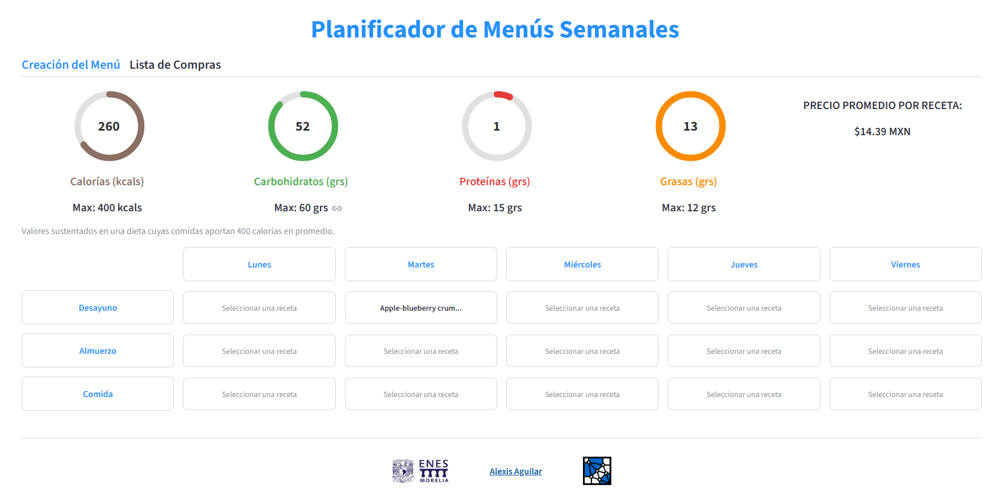
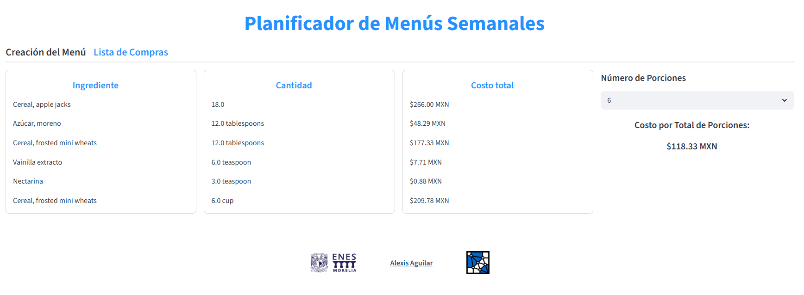

# Frontend and Dashboard <!-- omit in toc -->

## Table of Contents <!-- omit in toc -->
- [Recipes Recommendations](#recipes-recommendations)
- [Menu Planner and Nutrients Dashboard](#menu-planner-and-nutrients-dashboard)
- [Grocery List](#grocery-list)
- [References](#references)

## Recipes Recommendations
The system features an optimization-based engine designed to balance budget constraints with nutritional requirements:Cost Optimization: 
* Uses a heuristic to identify recipes that share common base ingredients, reducing procurement expenses through bulk-buying logic.
* **Nutritional Efficiency**: Simultaneously maximizes the *(Nutritional Density)/(Unit Cost)* ratio.
* **Balanced Planning**: Ensures economically efficient meal plans without compromising the menu's overall nutritional value.

## Menu Planner and Nutrients Dashboard
The interface is built with Streamlit (Streamlit, 2026), prioritizing rapid interaction and **data-heavy visualizations** to meet the project's core objectives:
* **Server-Side Execution**: Direct orchestration between the UI and the API/Database minimizes latency, ensuring fluid menu design and reactive feedback.
* **Real-Time Reactivity**: Any adjustment in input parameters triggers an immediate update in the system’s state, with high-priority visual feedback on budget impact and nutritional profiles.
* **Optimized UX**: The layout of controls and selectors is strategically designed to reduce adoption friction and streamline institutional decision-making.

The dashboard leverages **asynchronous API consumption** to synchronize the global application state with user selections:
* **Synchronous Metrics**: Immediate feedback on nutritional density, average cost per recipe, and consolidated ingredient lists as users integrate new preparations.
* **Strategic Design**: Dynamic visualizations transform data exploration into a specialized experience for high-level menu engineering and institutional planning.

## Grocery List
The system **tracks menu selections** throughout the user session to generate comprehensive procurement lists:
* **Session Persistence**: Recipes selected in the dashboard are automatically persisted to populate the ingredients section.
* **Scalable Portions**: Dynamic adjustment of ingredient quantities based on the specific number of students.
* **Administrative Breakdown**: Provides a full itemized list of ingredients with real-time price estimation to assist in institutional budgeting and financial planning.

## References
* Streamlit, I. (2026). Streamlit: A Faster Way to Build and Share Data Apps. https://streamlit.io